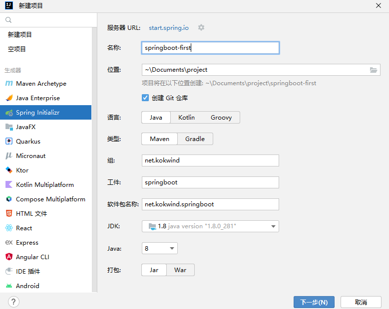
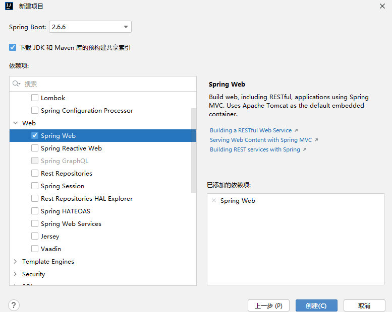
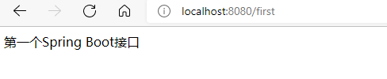

# Spring Boot

## 0 Spring Boot简介及新建

- 简化初始搭建以及开发过程
- 不在需要定义样板化的配置
- 快速应用开发
- Spring 最初利用IOC和AOP解耦
- 安装这种模式搞了MVC框架
- 写很多样板代码很麻烦，于是有了Spring Boot
- Spring Cloud是在Spring Boot基础上诞生的（分布式领域）


使用Idea集成的Spring Initializr创建Spring Boot项目






## 1 完成第一个接口开发
- Spring Boot的基础结构共三个文件：入口、配置文件、测试入口
- 生成的Application和ApplicationTests类都可以直接运行来启动当前创建的项目

新建一个接口，接口名称为`fisrtRequest`

```java
package net.kokwind.springboot.controller;

import org.springframework.web.bind.annotation.GetMapping;
import org.springframework.web.bind.annotation.RestController;

@RestController
public class ParaController {
    @GetMapping("/first")
    public String fisrtRequest() {
        return "第一个Spring Boot接口";
    }
}
```
启动项目，看看接口是否正常访问

