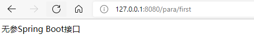

# Spring Boot入门

## 0 Spring Boot简介及新建

- 简化初始搭建以及开发过程
- 不在需要定义样板化的配置
- 快速应用开发
- Spring 最初利用IOC和AOP解耦
- 安装这种模式搞了MVC框架
- 写很多样板代码很麻烦，于是有了Spring Boot
- Spring Cloud是在Spring Boot基础上诞生的（分布式领域）


使用Idea集成的Spring Initializr创建Spring Boot项目


## 1 完成第一个接口开发
- Spring Boot的基础结构共三个文件：入口、配置文件、测试入口
- 生成的Application和ApplicationTests类都可以直接运行来启动当前创建的项目

新建接口

```java
package net.kokwind.springboot.controller;

import org.springframework.web.bind.annotation.*;

@RestController
@RequestMapping("/para")
public class ParaController {
    //无参数接口
    @GetMapping("/first")
    public String fisrtRequest() {
        return "无参Spring Boot接口";
    }

    //传递一个参数接口:127.0.0.1:8080/para/second?name=kokwind
    //忘记传参时设置默认值，可以使用@RequestParam(required = false,defaultValue = "ANY")
    @GetMapping("/second")
    public String secondRequest(@RequestParam(required = false,defaultValue = "ANY") String name) {
        return "问号接参数Spring Boot接口，参数为：" + name;
    }

    //通过path传递参数接口：127.0.0.1:8080/para/third/kokwind/
    @GetMapping("/third/{name}")
    public String thirdRequest(@PathVariable String name) {
        return "Path带参数Spring Boot接口，参数为：" + name ;
    }
}
```
启动项目，看看接口是否正常访问




## 2 配置文件
### 2。1 Web项目的三层结构
- Controller主要时对外暴露接口
- Service主要是业务逻辑
- DAO主要是数据库操作

### 2.2 Spring Boot配置文件简介
在`resources`中可以看到`application.properties`文件，可以在这里配置一些默认的配置
比如设置端口为80
```
server.port=80
```
也可以改成yml格式，分层级配置，可以通过toyaml.com在线进行转换

### 2.3 配置自定义属性
在`resources`中可以看到`application.properties`文件中添加了自定义属性

```
name="kokwind"
age=18
```

编写Controller时，可以通过@Value注解来获取自定义属性

```java
package net.kokwind.springboot.controller;

import org.springframework.beans.factory.annotation.Value;
import org.springframework.web.bind.annotation.GetMapping;
import org.springframework.web.bind.annotation.RestController;

@RestController
public class GetParaController {
    @Value("${name}")
    String name;
    @Value("${age}")
    int age;

    @GetMapping("/getinfo")
    public String getInfo() {
        return name + " : " + age;
    }
}

```

测试：


或者，使用配置类读取
在`resources`中可以看到`application.properties`文件中添加了自定义属性

```
person.name="kokwind"
person.age=18
```
新建一个配置类，添加注解@Component和@ConfigurationProperties
```java
package net.kokwind.springboot.config;

import org.springframework.boot.context.properties.ConfigurationProperties;
import org.springframework.stereotype.Component;

@Component
@ConfigurationProperties(prefix = "person")
public class PersonConfig {
    String name;
    Integer age;

    public String getName() {
        return name;
    }

    public void setName(String name) {
        this.name = name;
    }

    public Integer getAge() {
        return age;
    }

    public void setAge(Integer age) {
        this.age = age;
    }
}
```

修改控制器代码
```java
package net.kokwind.springboot.controller;

import net.kokwind.springboot.config.PersonConfig;
import org.springframework.beans.factory.annotation.Autowired;
import org.springframework.beans.factory.annotation.Value;
import org.springframework.web.bind.annotation.GetMapping;
import org.springframework.web.bind.annotation.RestController;

@RestController
public class GetParaController {
//    @Value("${name}")
//    String name;
//    @Value("${age}")
//    int age;
    @Autowired
    PersonConfig personConfig;

    @GetMapping("/getinfo")
    public String getInfo() {
        return personConfig.getName() + " : " + personConfig.getAge();
    }
}

```

测试：


## 3 编写Service和DAO

### 3.1 新建数据库和表


### 3.2 添加maven依赖
在`pom.xml`中添加mybatis和mysql依赖
```xml
        <!-- 引入mybatis依赖 -->
        <dependency>
            <groupId>org.mybatis.spring.boot</groupId>
            <artifactId>mybatis-spring-boot-starter</artifactId>
            <version>2.2.2</version>
        </dependency>
        <!-- 引入mysql依赖 -->
        <dependency>
            <groupId>mysql</groupId>
            <artifactId>mysql-connector-java</artifactId>
        </dependency>
```

### 3.3 新建对应person表的实体类
新建软件包`net.kokwind.springboot.entity`

新建实体类`Person`，生成get、set和toString方法

```java
package net.kokwind.springboot.entity;

public class Person {
    private Integer id;
    private String name;

    public Integer getId() {
        return id;
    }

    public void setId(Integer id) {
        this.id = id;
    }

    public String getName() {
        return name;
    }

    public void setName(String name) {
        this.name = name;
    }

    @Override
    public String toString() {
        return "Person{" +
                "id=" + id +
                ", name='" + name + '\'' +
                '}';
    }
}
```

### 3.4 新建对应person表的mapper
新建软件包`net.kokwind.springboot.mapper`

然后创建一个`PersonMapper`接口，上面需要写上

@Mapper注释用来表示该接口类的实现类对象交给mybatis底层创建，然后交由Spring框架管理

@Repository注解修饰哪个类，则表明这个类具有对对象进行CRUD（增删改查）的功能

我们不用自己创建该接口的实现类对象而是在这个接口上采用了@Mapper注解让Mybatis底层为我们创建这个接口的实现类对象所以我们可以直接调用它的方法。


```java
package net.kokwind.springboot.mapper;

import net.kokwind.springboot.entity.Person;
import org.apache.ibatis.annotations.Mapper;
import org.apache.ibatis.annotations.Select;
import org.springframework.stereotype.Repository;

@Mapper
@Repository
public interface PersonMapper {
    @Select("select * from person where id = #{id}")
    Person getPersonById(Integer id);
}

```

### 3.4 新建对应person的service业务逻辑
新建软件包`net.kokwind.springboot.service`

然后创建一个`PersonService`类

@Service注解用于类上，标记当前类是一个service类，加上该注解会将当前类自动注入到spring容器中，不需要再在applicationContext.xml文件定义bean了。
在调用该service的时候只需要将该类注入接口中即可：
用@Autowired注解表示将这个接口类的实现类对象赋值给接口属性

```java
package net.kokwind.springboot.service;

import net.kokwind.springboot.entity.Person;
import net.kokwind.springboot.mapper.PersonMapper;
import org.springframework.beans.factory.annotation.Autowired;
import org.springframework.stereotype.Service;

@Service
public class PersonService {
    @Autowired
    private PersonMapper personMapper;

    public Person getPersonName(Integer id) {
        return personMapper.getPersonById(id);
    }
}


```


### 3.5 新建对应业务的controller
新建软件包`net.kokwind.springboot.controller`

新建`PersonController`类

```java
package net.kokwind.springboot.controller;

import net.kokwind.springboot.entity.Person;
import net.kokwind.springboot.service.PersonService;
import org.springframework.beans.factory.annotation.Autowired;
import org.springframework.web.bind.annotation.GetMapping;
import org.springframework.web.bind.annotation.RequestParam;
import org.springframework.web.bind.annotation.RestController;

@RestController
public class PersonController {
    @Autowired
    private PersonService personService;

    @GetMapping("/person")
    public String getPerson(@RequestParam Integer id) {
        Person person = personService.getPersonName(id);
        return person.toString();
    }

}
```

### 3.6 测试功能


